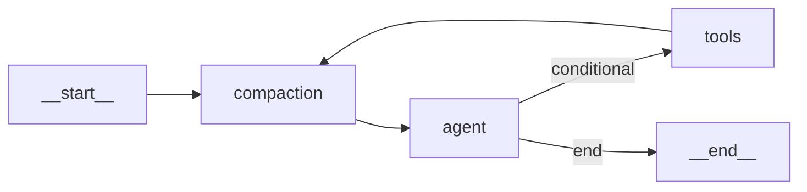

# Plan: `compaction_node` en el grafo LangGraph

Documento de fase 3 (memoria / contexto). Origen: plan de implementación del nodo de compactación.

## Contexto técnico detectado

- El estado vive hoy en [`packages/agent/src/graph.ts`](../../packages/agent/src/graph.ts) (`GraphState` con `Annotation.Root`), no hay `packages/agent/src/state.ts` en el repo en el momento de redactar esto.
- El reducer actual de `messages` es **solo append** (`(prev, next) => [...prev, ...next]`). Eso **impide** sustituir o recortar el historial desde un nodo: cualquier compactación real requiere **cambiar el reducer de `messages`** (no toca la lógica interna de `agentNode` ni de `toolExecutorNode`). En LangGraph JS v1, el patrón estándar es [`messagesStateReducer`](https://reference.langchain.com/javascript/langchain-langgraph/web/messagesStateReducer) + [`RemoveMessage`](https://reference.langchain.com/javascript/langchain-langgraph/web/RemoveMessage) con `REMOVE_ALL_MESSAGES` para reemplazar toda la lista, y **sustitución por `id`** cuando solo cambian mensajes existentes (p. ej. tool results limpiados con el mismo `id`).
- El modelo principal está en [`packages/agent/src/model.ts`](../../packages/agent/src/model.ts) (`createChatModel` → OpenRouter). La compactación LLM debe usar **otro** modelo (Haiku vía OpenRouter), p. ej. `anthropic/claude-3-5-haiku-20241022` (confirmar slug estable en OpenRouter al implementar).

## Topología objetivo

- **Orden crítico**: cada salida de `tools` pasa por `compaction` antes de `agent` (microcompact incluido).

## Estado (`state.ts` + import en `graph.ts`)

Crear [`packages/agent/src/state.ts`](../../packages/agent/src/state.ts) que exporte:

- `GraphState` con los campos actuales más:
  - `compactionCount: number` — p. ej. incrementar solo tras una **compactación LLM exitosa** (métrica clara).
  - **`compactionFailureStreak: number`** — necesario para el circuit breaker **persistente** con el checkpointer; con un solo contador no se puede distinguir “éxitos” de “racha de fallos” sin ambigüedad. Si prefieres estrictamente un solo campo en el estado, se puede acotar en la implementación (p. ej. solo `compactionFailureStreak` + log), pero se pierde la métrica `compactionCount` que pediste.

- `messages`: pasar de append manual a **`messagesStateReducer`** (import desde `@langchain/langgraph`, según la exportación real de la versión instalada) para soportar reemplazos y `RemoveMessage`.

[`packages/agent/src/graph.ts`](../../packages/agent/src/graph.ts): importar `GraphState` desde `./state` y **no** duplicar la definición del Annotation.

## Nuevo archivo [`packages/agent/src/nodes/compaction_node.ts`](../../packages/agent/src/nodes/compaction_node.ts)

Función pura `compactionNode(state, deps) -> Partial<GraphState>` (deps: modelo Haiku, ventana en tokens, opcional logger) con este orden:

### 1) Microcompact (siempre, “barato”)

- Recorrer `state.messages`; en todos los `ToolMessage` **salvo los últimos 5** (globales en el array), sustituir `content` por el placeholder acordado (p. ej. `"[tool result cleared]"`).
- Emitir actualización vía **mensajes con el mismo `id`** que los originales (así `messagesStateReducer` reemplaza en sitio y no duplica). Si algún mensaje antiguo no tuviera `id`, el reducer suele asignar uno al merge: conviene **normalizar ids** en el primer pase del nodo (o al crear mensajes) para que microcompact sea estable con checkpointer.

### 2) Estimación de ventana (umbral 80%)

- Añadir constante/env, p. ej. `AGENT_CONTEXT_WINDOW_TOKENS` (default razonable alineado al modelo principal, p. ej. 128000) y **umbral = 0.8 × ventana**.
- Estimar tokens del historial post-microcompact con heurística ligera (p. ej. longitud de texto serializado / 4) **sin** nuevas dependencias obligatorias; documentar que es conservador y ajustable.

### 3) Compactación LLM (solo si estimación > umbral)

- Invocar **Haiku** con un prompt fijo que exija **9 secciones estructuradas** en la salida (contenido exacto de las secciones en el código, en español si el producto es ES).
- Post-proceso: si la respuesta contiene `<analysis>...</analysis>`, **eliminar ese bloque** antes de inyectar.
- Reinyección: estrategia clara y determinista, por ejemplo:
  - `new RemoveMessage({ id: REMOVE_ALL_MESSAGES })` seguido de:
    - un único `SystemMessage` (o `HumanMessage` con rol explícito en el texto) con el resumen compactado **más** el **tail** de los últimos K mensajes “crudos” (p. ej. último turno humano + últimos AIMessage/ToolMessage) para no perder el hilo inmediato — ajustar K para que quepa holgadamente **por debajo del 80%** dejando margen a la llamada del agente (coherente con tu comentario del buffer).
- Éxito: `compactionFailureStreak: 0`, `compactionCount: state.compactionCount + 1`.
- Fallo (timeout, error API, parseo vacío, etc.): `compactionFailureStreak: state.compactionFailureStreak + 1`; si `>= 3`, **devolver `{}` o solo microcompact** sin LLM (mensajes ya mutados solo si el microcompact se aplicó en el mismo paso — definir: aplicar microcompact primero y persistir siempre; LLM opcional).

### 4) Circuit breaker

- Tres fallos **consecutivos** de la ruta LLM: no reintentar en bucle; seguir con historial **solo microcompactado** (o sin cambios si el fallo ocurre antes de aplicar escritura — recomendación: **microcompact siempre aplicado** al inicio del nodo para cumplir el edge tools→compaction).

## [`packages/agent/src/model.ts`](../../packages/agent/src/model.ts)

- Añadir `createCompactionModel()` (Haiku, temperatura baja), misma base OpenRouter y `OPENROUTER_API_KEY`, sin cambiar `createChatModel()` usado por el agente.

## [`packages/agent/src/graph.ts`](../../packages/agent/src/graph.ts)

- Registrar `.addNode("compaction", compactionNode)` (wrapper que cierra sobre deps si hace falta, igual que `agentNode`/`toolExecutorNode` hoy).
- Sustituir aristas:
  - `__start__` → `compaction` → `agent`
  - `tools` → `compaction` (eliminar `tools` → `agent` directo).
- Mantener **intactos**: cuerpo de `agentNode`, cuerpo de `toolExecutorNode`, `shouldContinue` / `MAX_TOOL_ITERATIONS` / `interrupt` / checkpointer / firma de `AgentInput`.

## Invocación inicial

- En `app.invoke({ ... })`, incluir valores por defecto para los nuevos campos del Annotation (`0`) o confiar en `default: () => 0` en el Annotation.

## Pruebas y verificación manual

- `npm run type-check` en el workspace (o `turbo run type-check`).
- Casos manuales: thread largo con muchos `ToolMessage` (microcompact), forzar umbral bajo en env para disparar Haiku, forzar error de red para ver `compactionFailureStreak` y paso a “sin LLM” en el tercer fallo.

## Riesgos / decisiones a cerrar en implementación

- **Política de tail post-LLM** (cuántos mensajes crudos se conservan): debe quedar fijada en código con constantes documentadas para equilibrio contexto vs ventana.
- **Slug Haiku** en OpenRouter: verificar en documentación al codificar.
