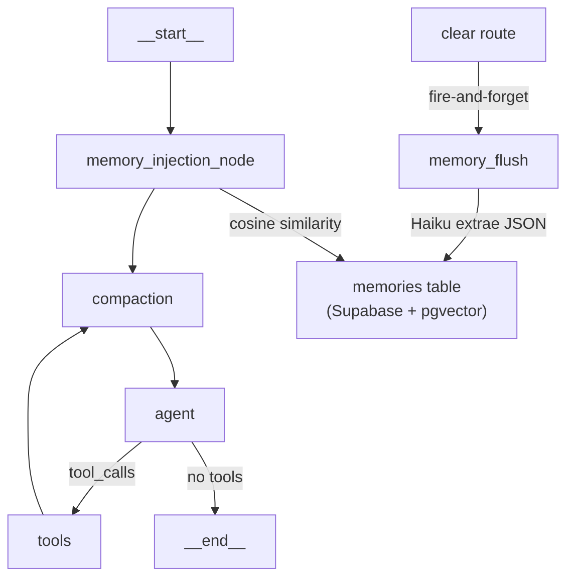

# Phase 3 — Memoria a largo plazo

## Contexto clave del codebase

- Monorepo: `packages/agent` (grafo LangGraph), `packages/db` (Supabase queries), `apps/web` (Next.js API routes)
- Modelos vía OpenRouter con `ChatOpenAI` + `configuration.baseURL`; Haiku ya existe en `createCompactionModel()`
- `GraphState` tiene `userId` y `systemPrompt` — no hay que cambiar la firma del estado
- `agentNode` y `toolExecutorNode` son closures que capturan `db`/`userId` del scope de `runAgent` — el nodo de inyección seguirá el mismo patrón
- Trigger de flush: `apps/web/src/app/api/sessions/[sessionId]/clear/route.ts` — es el único evento explícito de "sesión cerrada"

## Flujo de datos



## Archivos a crear

### 1. `packages/db/supabase/migrations/00004_memories.sql`

```sql
CREATE EXTENSION IF NOT EXISTS vector;

CREATE TABLE public.memories (
  id               uuid        PRIMARY KEY DEFAULT gen_random_uuid(),
  user_id          uuid        NOT NULL REFERENCES public.profiles(id) ON DELETE CASCADE,
  type             text        NOT NULL CHECK (type IN ('episodic', 'semantic', 'procedural')),
  content          text        NOT NULL,
  embedding        vector(1536) NOT NULL,
  retrieval_count  int         NOT NULL DEFAULT 0,
  created_at       timestamptz NOT NULL DEFAULT now(),
  last_retrieved_at timestamptz
);

ALTER TABLE public.memories ENABLE ROW LEVEL SECURITY;

CREATE POLICY "Users can view own memories"
  ON public.memories FOR SELECT USING (auth.uid() = user_id);

CREATE INDEX idx_memories_user_id ON public.memories (user_id);

-- Función RPC para búsqueda cosine similarity (service-role la llama sin RLS)
CREATE OR REPLACE FUNCTION match_memories(
  query_embedding vector(1536),
  match_user_id   uuid,
  match_count     int DEFAULT 6
)
RETURNS TABLE (id uuid, type text, content text, retrieval_count int, similarity float)
LANGUAGE sql STABLE AS $$
  SELECT id, type, content, retrieval_count,
         1 - (embedding <=> query_embedding) AS similarity
  FROM public.memories
  WHERE user_id = match_user_id
  ORDER BY embedding <=> query_embedding
  LIMIT match_count;
$$;
```

### 2. `packages/db/src/queries/memories.ts`

Queries:

- `insertMemories(db, records[])` — inserta batch con embedding
- `matchMemories(db, userId, queryEmbedding, limit?)` — llama RPC `match_memories`
- `incrementRetrievalCount(db, ids[])` — `UPDATE ... retrieval_count += 1, last_retrieved_at = now()`

Tipo exportado: `Memory { id, user_id, type, content, retrieval_count, created_at, last_retrieved_at }`

### 3. `packages/agent/src/memory_flush.ts`

```typescript
export async function flushMemory(params: {
  db: DbClient;
  userId: string;
  sessionId: string;
}): Promise<void>
```

Pasos internos:

1. `getSessionMessages(db, sessionId, 200)` — obtiene historial completo
2. Si hay menos de 3 mensajes, termina sin hacer nada
3. Llama a Haiku (`createCompactionModel()`) con prompt estructurado → JSON `{ type, content }[]`
4. Si el array está vacío, termina
5. Para cada recuerdo, genera embedding con `OpenAIEmbeddings` (OpenRouter config, modelo `openai/text-embedding-3-small`)
6. `insertMemories(db, records)` — batch insert

Prompt de extracción (conservador):

```
Extrae de esta conversación solo los hechos que seguirán siendo verdad en la próxima sesión.
Responde ÚNICAMENTE con JSON válido: [{ "type": "episodic|semantic|procedural", "content": "string" }]
Si no hay nada relevante, responde con [].
No incluyas conversación trivial, ni saludos, ni preguntas pendientes de respuesta.
```

### 4. `packages/agent/src/nodes/memory_injection_node.ts`

```typescript
export function buildMemoryInjectionNode(db: DbClient, userId: string) {
  return async (state: GraphState): Promise<Partial<GraphState>>
}
```

Pasos internos:

1. Obtiene el último `HumanMessage` del estado para el input actual
2. Si no hay HumanMessage, retorna `{}` (no-op)
3. Genera embedding del input (`OpenAIEmbeddings`)
4. `matchMemories(db, userId, embedding, 6)`
5. Si hay resultados: `incrementRetrievalCount(db, ids)` (fire-and-forget, no await)
6. Formatea bloque `[MEMORIA DEL USUARIO]` y lo antepone al `state.systemPrompt`
7. Retorna `{ systemPrompt: enrichedPrompt }`

### 5. `packages/agent/src/model.ts` — agregar función

```typescript
export function createEmbeddingModel() {
  // OpenAIEmbeddings con baseURL de OpenRouter
  // model: "openai/text-embedding-3-small"
}
```

## Archivos a modificar

### `packages/agent/src/graph.ts`

- Importar `buildMemoryInjectionNode`
- Construir el nodo con `buildMemoryInjectionNode(db, userId)` dentro de `runAgent`
- Agregar al grafo:

  ```
  .addNode("memory_injection", memoryInjectionNode)
  .addEdge("__start__", "memory_injection")
  .addEdge("memory_injection", "compaction")
  ```

  (reemplaza el edge directo `__start__ → compaction`)

### `packages/db/src/index.ts`

- Agregar `export * from "./queries/memories"`

### `packages/agent/src/index.ts`

- Agregar `export { flushMemory } from "./memory_flush"`

### `apps/web/src/app/api/sessions/[sessionId]/clear/route.ts`

- Importar `flushMemory` y `createServerClient`
- Antes del `clearSessionMessages`, disparar `flushMemory({ db, userId: user.id, sessionId })` como fire-and-forget (`void flushMemory(...)`)

## Lo que NO se toca

`compaction_node.ts`, `compaction_log.ts`, `toolExecutorNode`, HITL, checkpointer, `iterationCount`, `GraphState`

## Notas de implementación

- Los errores en `memory_flush` y en `memory_injection_node` son silenciosos (try/catch con `console.error`) — nunca bloquean el flujo del agente
- `OpenAIEmbeddings` ya disponible vía `@langchain/openai` (dependencia existente), configurado con `configuration.baseURL = "https://openrouter.ai/api/v1"`
- Sesiones abandonadas (sin clear explícito): no se flushean en esta fase; se puede agregar un cron post-phase
