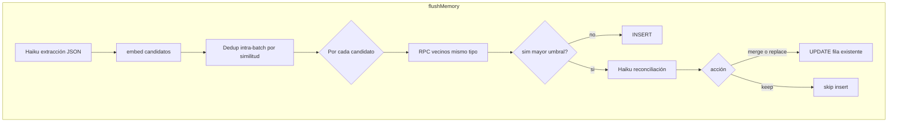

# Plan: deduplicación y fusión de memorias (post-flush)

Documento complementario a [longterm-memory-plan.md](./longterm-memory-plan.md). No modifica ese archivo.

## Alcance y restricción

- **Sí se tocan** en implementación: migración nueva, `packages/db/src/queries/memories.ts`, `packages/agent/src/memory_flush.ts`, `packages/types/src/index.ts` (`Profile`), `packages/db/src/queries/profiles.ts` y, si hace falta exponer el umbral al cliente, `apps/web/src/app/api/chat/route.ts`. **No** es obligatorio tocar el grafo, `memory_injection_node`, `compaction`, checkpointer ni `clear/route` salvo UI del umbral.

## Problema actual

`flushMemory` inserta siempre filas nuevas; `insertMemories` es un `insert` masivo sin comprobar vecinos en embedding, lo que acumula duplicados semánticos y ruido.

## Umbral configurable por usuario

- Columna en `profiles`, por ejemplo `memory_merge_similarity_threshold` (`real`, 0–1, cosine alineado con `match_memories`), default recomendado `0.88`.
- Si la mejor coincidencia en BD para el mismo `user_id` y mismo `type` tiene similitud **≥** umbral, no se hace insert ciego: entra la **fase de reconciliación**.
- Leer umbral vía `Profile` / `getProfile` dentro de `flushMemory`.

Opcional: endpoint o pantalla de ajustes con `upsertProfile`.

## Búsqueda de candidatos a duplicado (antes de insert)

Cosine vía pgvector (`<=>`).

1. **RPC nueva** (migración `00005_...sql`), p. ej. `match_memories_for_merge`: mismos parámetros de similitud que `match_memories` pero `WHERE user_id = ... AND type = memory_type`.
2. `matchMemoriesForMerge` en TypeScript; si `similarity < threshold` → **insert nuevo**.

## Reconciliación con LLM

Si hay vecino con `similarity >= threshold`:

- Haiku (`createCompactionModel`) con salida JSON, p. ej. `{ "action": "keep_existing" | "replace_with_new" | "merge", "final_content": "..." }`.
- Fallback ante JSON inválido: `keep_existing`.

## Deduplicación intra-flush (batch)

Embeddings de candidatos; pares mismo `type` con cosine ≥ umbral → resolver (LLM o fast-path si similitud muy alta); reducir lista antes de tocar BD.

## Flujo resumido

## Lo que NO se toca

Alineado con [longterm-memory-plan.md](./longterm-memory-plan.md) (líneas 164-166). Durante deduplicación/fusión **no se modifican**:

`compaction_node.ts`, `compaction_log.ts`, `toolExecutorNode`, HITL, checkpointer, `iterationCount`, `GraphState`

## Orden de implementación sugerido

1. Migración: columna en `profiles` + RPC `match_memories_for_merge` (+ opcional `updated_at` en `memories`).
2. Types + lecturas de perfil en web.
3. `memories.ts`: `updateMemoryContentEmbedding`, `matchMemoriesForMerge`.
4. `memory_flush.ts`: umbral desde perfil, dedup batch, reconciliación, UPDATE/INSERT.

## Pruebas manuales

- Mismo hecho en dos sesiones → una fila actualizada, no dos.
- Umbral alto (0.95) vs bajo (0.75).
- Contradicciones → preferir `keep_existing` o `replace` explícito; revisar logs.

